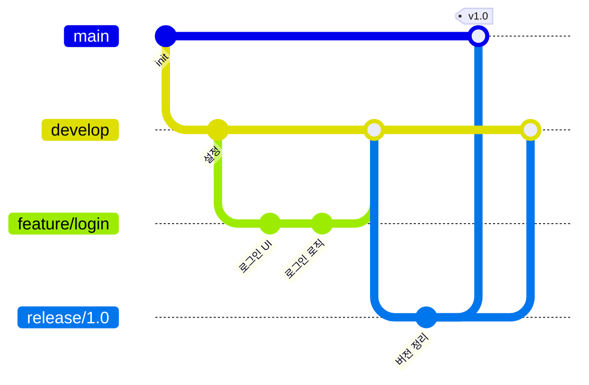
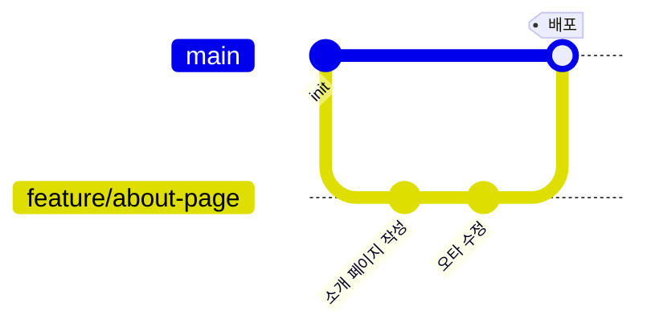
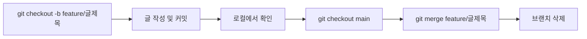

## 들어가며 (Situation)

지금은 이 블로그를 혼자 관리하고 있어서, 지금까지는 `main` 브랜치 하나로도 충분했다.
그런데 앞으로 팀 프로젝트나 PR(Pull Request)로 협업할 상황을 대비하려면, "브랜치를 어떤 규칙으로 나누고 합칠 것인가"를 미리 정리해둘 필요가 있었다. 실제로 겪은 문제는 아직 없지만, 협업이 시작된 뒤에 규칙 없이 브랜치를 막 만들면 나중에 더 큰 혼란이 생길 거라고 판단해서 미리 공부해보기로 했다.

## 문제 상황 (Task)

브랜치 전략을 검색해보면 가장 먼저 나오는 게 **Git Flow**인데, 막상 보면 브랜치 종류가 5가지(`main`, `develop`, `feature`, `release`, `hotfix`)나 돼서 "이걸 나 혼자 쓰는 블로그에도 다 적용해야 하나?"라는 의문이 들었다. 그래서 다음 두 가지를 확인하고 싶었다.

- Git Flow와 더 단순한 전략(GitHub Flow)은 정확히 뭐가 다른가?
- 지금 내 블로그(1인 프로젝트)에는 어떤 전략이 맞을까?

## 해결 과정 (Action)

### 1. Git Flow 구조 이해하기

Git Flow는 Vincent Driessen이 제안한 브랜칭 모델로, 브랜치마다 역할이 명확히 정해져 있다.

| 브랜치 | 역할 |
|---|---|
| `main` | 실제 배포된(release) 상태만 존재 |
| `develop` | 다음 배포를 준비하는 개발 통합 브랜치 |
| `feature/*` | 기능 하나를 개발할 때 `develop`에서 分기 |
| `release/*` | 배포 직전 마무리 작업(버그 수정, 버전 정리)용 |
| `hotfix/*` | 배포된 `main`에서 긴급 버그를 고칠 때 |

이 구조를 보고 든 생각은, **`release`, `hotfix` 브랜치는 "정해진 배포 일정과 운영 환경이 있는 팀"에 맞춰진 규칙**이라는 점이었다. 배포 버전 관리가 복잡한 큰 프로젝트에는 유용하지만, 그만큼 브랜치 관리 자체에 신경 쓸 게 많아진다.

### 2. GitHub Flow와 비교

GitHub Flow는 브랜치를 `main`과 `feature` 두 종류로만 단순화한 모델이다.

| 항목 | Git Flow | GitHub Flow |
|---|---|---|
| 브랜치 종류 | 5종 (`main`,`develop`,`feature`,`release`,`hotfix`) | 2종 (`main`,`feature`) |
| 배포 주기 | 정해진 릴리즈 버전 단위 | 언제든지, merge 후 바로 |
| 적합한 상황 | 여러 버전을 동시에 운영하는 팀 프로젝트 | 지속적으로 배포하는 웹 서비스, 개인/소규모 프로젝트 |
| 학습 난이도 | 상대적으로 높음 | 낮음 |

### 3. 내 블로그에 맞는 규칙 정하기

내 블로그는 "동시에 여러 버전을 운영"하지도 않고, "정해진 릴리즈 일정"도 없다. 글 하나를 완성하면 바로 배포(merge)하는 구조이기 때문에, Git Flow의 `develop`/`release`/`hotfix`는 지금 단계에서는 오히려 관리 부담만 늘어난다고 판단했다. 그래서 GitHub Flow를 기반으로 아래처럼 규칙을 단순화했다.

| 규칙 | 내용 |
|---|---|
| `main` | 항상 배포 가능한 상태만 유지한다 |
| 새 작업은 브랜치부터 | `main`에서 바로 작업하지 않고, `feature/글제목`처럼 브랜치를 만든다 |
| merge 전 확인 | 로컬에서 결과를 확인한 뒤 `main`으로 merge한다 |
| merge 후 삭제 | 다 쓴 feature 브랜치는 지워서 브랜치 목록을 깨끗하게 유지한다 |

## 결과 (Result)

아직 실제로 협업을 시작한 건 아니라서 정량적인 성과는 없지만, 이번 정리를 통해 두 가지를 명확히 했다.

- **지금 단계에서는 Git Flow가 과하다**는 걸 구조를 직접 비교해보고 확인했다.
- 앞으로 이 블로그에 글을 쓸 때는 `main`에서 바로 작업하지 않고, 위 4단계 규칙(브랜치 생성 → 작업 → 확인 → merge → 삭제)을 지키기로 했다.
- 나중에 팀 프로젝트에 들어가서 배포 버전 관리가 필요해지면, 그때는 Git Flow 쪽 규칙을 다시 검토할 예정이다.

## 더 학습하면 좋은 개념

- **Pull Request(PR) 리뷰 프로세스** — GitHub Flow는 merge 전에 PR로 리뷰받는 것을 전제로 한다. 실제 협업에서는 이 리뷰 단계가 브랜치 전략만큼 중요하다.
- **Trunk-Based Development** — feature 브랜치조차 최소화하고 `main`에 자주 작은 단위로 merge하는 전략. GitHub Flow보다 더 빠른 배포 주기를 가진 팀에서 쓰인다.
- **Semantic Versioning(SemVer)** — Git Flow의 `release` 브랜치를 이해하려면, 버전 번호를 어떻게 매기는지(`v1.2.3`)에 대한 규칙을 함께 알아야 한다.
- **브랜치 보호 규칙(Branch Protection Rules)** — GitHub에서 `main`에 직접 push를 막고 PR을 강제하는 설정. 규칙을 "말로만" 정하는 것과 "시스템으로 강제"하는 것의 차이를 보여준다.

## 참고 자료

- [Git 공식 문서 - git-branch](https://git-scm.com/docs/git-branch)
- [GitHub 공식 문서 - GitHub flow](https://docs.github.com/en/get-started/using-github/github-flow)
- [A successful Git branching model (Git Flow 원문, Vincent Driessen)](https://nvie.com/posts/a-successful-git-branching-model/)
