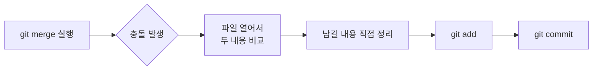

<script src="https://cdn.jsdelivr.net/npm/mermaid@10/dist/mermaid.min.js"></script>
<script>mermaid.initialize({ startOnLoad: true });</script>

## 들어가며 (Situation)

이 블로그 저장소를 로컬과 GitHub(원격) 양쪽에서 작업하고 있었다. 로컬에서 커밋을 쌓아둔 상태였는데, 원격에도 이미 다른 커밋이 올라가 있어서 두 브랜치를 `merge`로 합쳐야 하는 상황이 됐다.

## 문제 상황 (Task)

로컬 브랜치와 원격 브랜치, 양쪽에서 **같은 파일**을 서로 다르게 고쳐놓은 상태였다. `merge`를 실행하니 Git이 자동으로 합치지 못하고 멈췄다. 어느 쪽 내용이 맞는지는 Git이 판단할 수 없는 부분이라, 결국 사람이 직접 결정해야 하는 상황이었다.

## 해결 과정 (Action)

충돌이 나면 파일 안에 아래처럼 표시가 남는다.

```
<<<<<<< HEAD
지금 내 브랜치(로컬)에서 고친 내용
=======
merge하려는 브랜치(원격)에서 고친 내용
>>>>>>> origin/main
```

충돌을 해결하는 방법에는 몇 가지 선택지가 있었다.

| 방법 | 내용 | 이번에 선택했는가 |
|---|---|---|
| 충돌 표시 직접 수정 | 파일을 열어서 두 내용을 비교하고, 남길 부분을 직접 골라 정리 | O |
| `--ours` / `--theirs` | 한쪽 브랜치 내용으로 통째로 덮어쓰기 | X |
| `merge --abort` 후 재시도 | merge를 취소하고, 순서를 바꿔서(예: pull 먼저) 다시 시도 | X |

`--ours`/`--theirs`는 한쪽 내용을 통째로 버리는 방식이라 빠르지만, 이번에는 양쪽 다 의미가 있는 수정이어서 내용을 잃고 싶지 않았다. 그래서 파일을 직접 열어 `<<<<<<<`, `=======`, `>>>>>>>` 표시를 지우면서 두 내용을 비교해 남길 부분을 정리했다.



정리가 끝난 뒤 `git add`로 "해결됐다"고 표시하고, `git commit`으로 merge를 마무리했다.

## 결과 (Result)

이번에 충돌이 크게 느껴졌던 이유를 돌아보니, 로컬에서 여러 변경을 한 번에 모아뒀다가 커밋한 게 원인이었다. 바뀐 부분이 많을수록 원격과 겹치는 부분도 늘어나서 비교하고 정리해야 할 범위가 커졌다.

그래서 앞으로는 **커밋을 작게, 자주** 하기로 했다. 변경 단위가 작으면 merge 시점에 겹치는 부분도 작아지고, 설령 충돌이 나더라도 비교해야 할 범위가 좁아서 해결이 훨씬 쉬워질 거라고 판단했다.

## 더 학습하면 좋은 개념

- **`git pull --rebase`** — merge 대신 rebase로 원격 변경사항을 받아오면 커밋 히스토리가 더 깔끔하게 유지된다. merge와 rebase의 차이를 알면 상황에 맞는 방법을 고를 수 있다.
- **`git diff` / `git log -p`** — merge 전에 로컬과 원격이 각각 무엇을 바꿨는지 미리 확인하는 습관을 들이면, 충돌이 날 부분을 예측할 수 있다.
- **Merge tool (`git mergetool`)** — 충돌 표시를 텍스트로 직접 읽는 대신, VS Code나 다른 GUI 도구로 좌우 비교하며 해결하는 방법도 있다. 충돌 범위가 커질수록 유용하다.
- **원자적 커밋(Atomic Commit)** — 하나의 커밋에는 하나의 논리적 변경만 담는 원칙. 이번에 배운 "커밋을 작게 자주 하기"가 결국 이 개념과 연결된다.

## 참고 자료

- [Git 공식 문서 - git-merge](https://git-scm.com/docs/git-merge)
- [Git 공식 문서 - 충돌 해결하기](https://git-scm.com/book/en/v2/Git-Branching-Basic-Branching-and-Merging#_basic_merge_conflicts)
